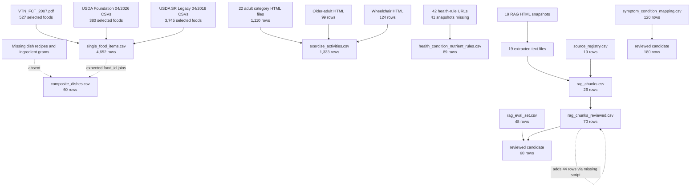

# HealthyPlan data processing pipeline

Audit date: 2026-07-14

## Reproducibility verdict

No executable processing pipeline exists in the audited repository. There are no `.py`, `.ipynb`, `.js`, `.ts`, SQL, shell, package-lock, requirements, environment, Makefile, CI, schema, or README files. Consequently:

- no final dataset can be rebuilt from raw inputs within this repository;
- hardcoded local paths cannot be assessed because the scripts are absent;
- random seeds cannot be assessed;
- manual edits after generation cannot be distinguished from generated output;
- producer/consumer relationships are inferred from IDs, schemas, row counts, notes, and source-file matches, not from executable code;
- no “correct existing script order” can be reported. The order below is the required/recommended recovery order.

## Inferred raw-to-final data flow

Solid arrows indicate a relationship supported by preserved keys/content. Dotted arrows indicate an intended or claimed relationship whose input/script is missing.

## Verified transformations and inferred steps

| Domain | Inputs | Observed output | Verified facts | Missing processing evidence |
|---|---|---|---|---|
| VTN food extraction | `VTN_FCT_2007.pdf` | 527 VTN rows in `single_food_items.csv` | Source food codes and representative page values are present | PDF table extraction, page mapping, OCR cleanup, missing-value parsing |
| Foundation selection | Six Foundation CSVs | 380 Foundation rows | All source IDs are `foundation_food`; core raw nutrients generally match | Why 380 of 469 were selected; energy choice; negative-carb handling; missing-value rules |
| SR selection | Seven SR CSVs | 3,745 SR rows | All source IDs exist and checked nutrients match | Why 3,745 of 7,793 were selected |
| Food translation/merge | Three food sources | 4,652 unified rows | Counts add exactly: 527 + 380 + 3,745 | Translation model/dictionary, canonicalization, duplicate strategy, fallback selection, hashes |
| Dish calculation | Missing recipes + likely single foods | 60 serving totals | Energy is close to `4P+9F+4C` | Entire recipe/ingredient layer and calculation implementation |
| Adult exercise parsing | 22 category HTML files | 1,110 rows | Exact code/MET/English match | HTML parser and category mapping |
| Older-adult exercise parsing | One HTML file | 99 rows | Exact code/MET/English match | Parser and code-padding rule |
| Wheelchair exercise parsing | One HTML file | 124 rows | Exact code/MET/English match | Parser |
| Exercise enrichment | Parsed activities | Vietnamese text, intensity, suitability, hashes | Final fields are populated | Translation rules, intensity thresholds, suitability rationale, row-hash method |
| Health-rule curation | 42 URLs | 89 rules | URLs, recommendations, units, access timestamp exist | Source snapshots, exact passage extraction, normalization, reviewer approval |
| RAG download | 19 URLs | 19 HTML snapshots + registry | Every registry ID has HTML | Downloader, TLS bypass rationale, timestamps, hashes |
| RAG text extraction | HTML snapshots | 19 `.txt` files | Text is nonempty and mostly contained in visible HTML | Boilerplate rules, encoding rules, extractor version |
| Initial chunking | Extracted text + registry | 26 chunks | Source IDs valid | Chunking parameters and paraphrase/generation process |
| Chunk expansion/review | 26 base chunks | 70 reviewed-file chunks | All base IDs retained; 44 IDs added | Script explicitly mentioned in notes, prompt/model/seed, actual human review |
| Router generation/review | 120 base synthetic rows | 180 reviewed-file rows | All base IDs retained; 60 added | Prompt/model/seed, label protocol, split creation |
| Evaluation generation/review | 48 base rows + chunks | 60 reviewed-file rows | All base IDs retained; 12 added | Question-generation method, annotation, leakage controls, one missing support link |

## Recommended recovery and execution order

This order is a specification for reconstructing the real pipeline after authentic scripts/inputs are recovered. It is not evidence that these steps were originally executed this way.

| Order | Required stage | Inputs | Outputs | Validation gate |
|---:|---|---|---|---|
| 1 | Create source manifest and freeze raw evidence | All PDF/CSV/HTML sources | Manifest with source ID, title, org, URL, version/date, retrieval date, size, SHA-256, license/terms | Every raw file has immutable identity; existing files unchanged |
| 2 | Validate USDA release schemas | Foundation and SR raw CSVs | Raw validation report | Unique IDs, valid nonblank foreign keys, units, release/version confirmed |
| 3 | Extract VTN book | VTN PDF | Structured VTN staging table with page/food code/value/source-number fields | Visual sample against every food group; dash/source-number parsing test |
| 4 | Select USDA food records | Raw USDA tables plus explicit inclusion criteria | Foundation and SR staging tables | Source ID coverage; nutrient ID/unit map; documented exclusion counts |
| 5 | Normalize nutrients | Three staging sources | Standard per-100-g nutrient schema | No negative values; unit/basis tests; missingness report; no silent clamping |
| 6 | Translate and normalize names | Standardized food rows | Bilingual food staging table plus review queue | Model/dictionary/version recorded; human review status stored |
| 7 | Deduplicate/canonicalize foods | Bilingual staging table | Canonical food mapping and final food table | Duplicate-name report; deterministic canonical IDs; fallback provenance |
| 8 | Acquire/validate dish recipes | Authentic dish sources | `dishes` and `dish_ingredients` staging tables | Every ingredient has grams and source; every `food_id` resolves |
| 9 | Calculate dish nutrients | Validated foods + ingredients | Final dish nutrients | Recompute formula per nutrient; serving/yield checks; source recipe retained |
| 10 | Parse Compendium HTML | 25 HTML files | Exercise staging table | Exact row counts 1,110/99/124; code/MET/description matches |
| 11 | Enrich exercise data | Exercise staging table | Final exercise table | Reviewed translation; documented intensity/suitability; safety rules separate from raw MET |
| 12 | Build health-source registry | Exact guideline/page snapshots | Health-rule source registry | Exact title/version/section/page and reviewer recorded |
| 13 | Curate executable health rules | Source registry + typed nutrient/attribute dictionary | Final rules table | Operands exist; units/basis compatible; conflicts adjudicated; clinician/dietitian sign-off |
| 14 | Download/verify RAG sources | RAG source registry URLs | Verified HTML snapshots and metadata | Standard TLS, status, hash, date/version, license/terms |
| 15 | Extract RAG text | Verified HTML | Clean text with source offsets | Boilerplate test, encoding test, source-to-text coverage |
| 16 | Generate deterministic chunks | Clean text + parameters | Draft chunks with passage offsets | Length bounds, no heading-only/duplicates/orphans, source support test |
| 17 | Human RAG review | Draft chunks | Approved/rejected chunks with reviewer/date/reason | Medical and localization approval; safety escalation text |
| 18 | Generate and review router examples | Prompt/model/seed + label taxonomy | Approved routing corpus | Ambiguity adjudication; balanced frozen train/dev/test splits |
| 19 | Generate and review evaluation set | Approved chunks + evaluation protocol | Frozen evaluation set | Every item grounded; no train/test leakage; difficulty/condition balance |
| 20 | Export and validate final release | All approved staging tables | Versioned final CSVs + validation report + hashes | Schema, FK, duplicates, nulls, ranges, source coverage, diff from prior release |

## Required manual review gates

Manual steps should be explicit artifacts rather than edits directly inside final CSVs:

1. VTN OCR/table extraction review, especially dash-versus-negative parsing.
2. Vietnamese translation/localization for food and exercise names.
3. Food duplicate/canonical mapping adjudication.
4. Recipe/ingredient validation by a knowledgeable Vietnamese food reviewer.
5. Health-rule source interpretation by a dietitian/clinician.
6. RAG chunk medical and Vietnamese localization review.
7. Routing ambiguity and evaluation-answer adjudication.

Each review record should include record ID, original value, proposed value, decision, reason, reviewer, date, and source locator. Final exports should be generated from review tables, not edited manually.

## Non-reproducible and potentially manual stages

- `single_food_items.csv` contains row hashes, canonical IDs, fallback metadata, translated names, and review reasons, showing that a nontrivial transformation once existed; none of its implementation is present.
- `composite_dishes.csv` appears to contain precomputed totals. Without ingredient inputs, the calculations cannot be distinguished from manual entry.
- `health_condition_nutrient_rules.csv` combines many repeated source URLs with varying source labels and identical access times, consistent with batch/manual curation; the method is unknown.
- Reviewed RAG files contain repeated templated review notes and explicit references to a script, indicating automated expansion/review. The referenced script is missing.
- Later “reviewed” files are supersets, not only corrected versions. There is no change log showing which new rows were created or reviewed by whom.

## Missing dependencies and controls

| Missing item | Why required |
|---|---|
| Dependency/environment lockfile | Reproduce parsers, encoding, numeric behavior, and hashes |
| Source manifest/checksums | Prove exact raw inputs and detect later changes |
| Database schema/codebook | Enforce IDs, enums, units, and per-100-g/per-serving/per-day semantics |
| Deterministic configuration/seeds | Reproduce synthetic routing/evaluation/chunk expansion |
| Validation test suite | Prevent negative nutrients, orphan IDs, missing support links, and incompatible rule operands |
| Release manifest | Identify authoritative base/reviewed files and record output hashes |
| Review/audit log | Separate machine generation from human approval |

## Authoritative-version assessment

- `rag_chunks_reviewed.csv`, `symptom_condition_mapping_reviewed.csv`, and `rag_eval_set_reviewed.csv` are the probable current candidates because they are later, wider, and strict supersets of base IDs.
- They are not proven authoritative because no runtime consumer, manifest, or documentation exists, and every row remains `needs_review`.
- The three base RAG CSVs must remain as evidence until an owner confirms authority and a release manifest is created.
- The four core CSVs have no alternate versions in the repository and are therefore the only available candidates, not necessarily validated finals.

## Pipeline conclusion

The raw inputs are sufficient to reconstruct food, exercise, and RAG-source stages, but not the original transformations. Dish raw inputs are absent, most health-rule source snapshots are absent, and synthetic RAG generation artifacts are absent. Recovering authentic scripts and inputs is preferable to reverse-engineering final files because reverse engineering would not restore academic provenance.
